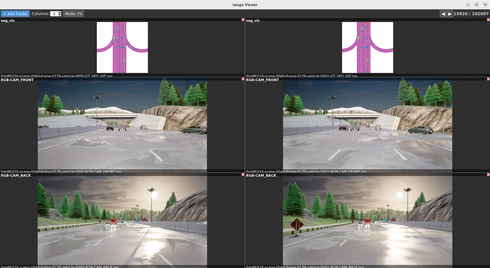

<div align="center">

# 🖼️ Side-by-Side Image Viewer

**A lightweight, multi-folder image viewer for comparing images side by side.**

Built with Python and Tkinter — no heavy dependencies, just simplicity.



---

[](https://www.python.org/)
[](LICENSE)
[]()

</div>

## ✨ Features

| Feature | Description |
|---|---|
| **Multi-folder compare** | Load multiple image folders and view them side by side |
| **Flexible grid layout** | Adjustable column count with resizable panes |
| **Zoom & Pan** | Scroll to zoom (cursor-centered), click-drag to pan |
| **Keyboard navigation** | Arrow keys to browse, Home/End to jump |
| **Natural sorting** | Files are sorted naturally (`img2` before `img10`) |
| **EXIF auto-rotation** | Images are automatically oriented correctly |
| **Fit / Original mode** | Toggle between fit-to-canvas and native resolution |
| **Removable panels** | Close any folder panel with a single click |

## 📦 Installation

### Prerequisites

- Python 3.10 or higher
- Tkinter (usually included with Python)

### Setup

```bash
# Clone the repository
git clone https://github.com/GoodarzMehr/SideBySideImageViewer.git
cd SideBySideImageViewer

# Install dependencies
pip install -r requirements.txt
```

## 🚀 Usage

```bash
python viewer.py
```

1. Click **"+ Add Folder"** to load an image directory.
2. Add more folders to compare images side by side.
3. Use **← →** arrow keys to navigate through images.
4. **Scroll** to zoom in/out (centered on cursor).
5. **Click and drag** to pan around zoomed images.

### Keyboard Shortcuts

| Key | Action |
|---|---|
| `←` | Previous image |
| `→` | Next image |
| `Home` | Jump to first image |
| `End` | Jump to last image |

### Supported Formats

PNG, JPG, JPEG, BMP, GIF, TIFF, TIF, WebP

## 🔧 Configuration

The toolbar provides quick access to:

- **Columns** — set how many folders appear per row (1–10)
- **Mode: Fit / Original** — toggle between fitting images to the canvas or displaying at native resolution

Pane dividers are **draggable**, so you can resize each panel freely.

## 📄 License

This project is licensed under the MIT License — see the [LICENSE](LICENSE) file for details.
